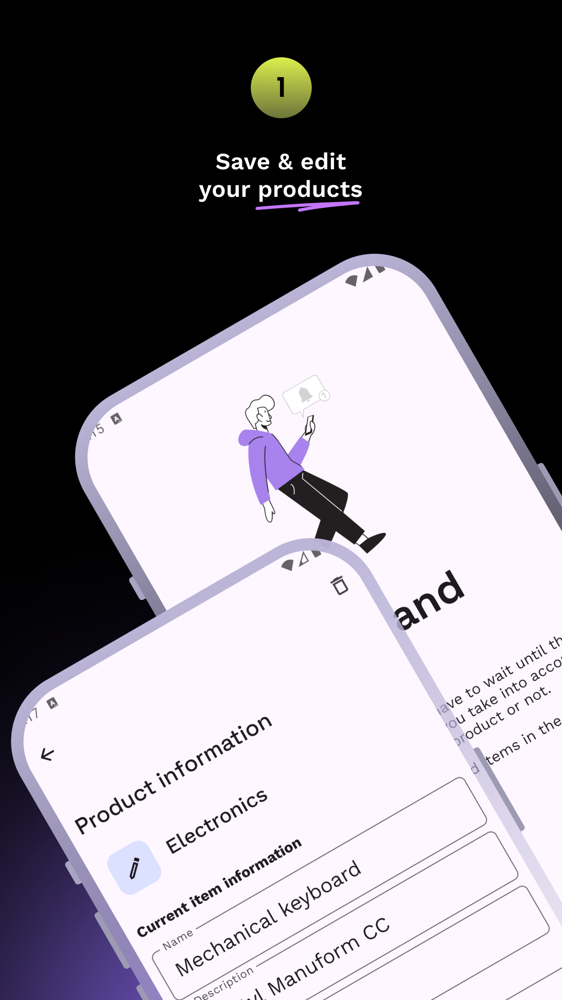
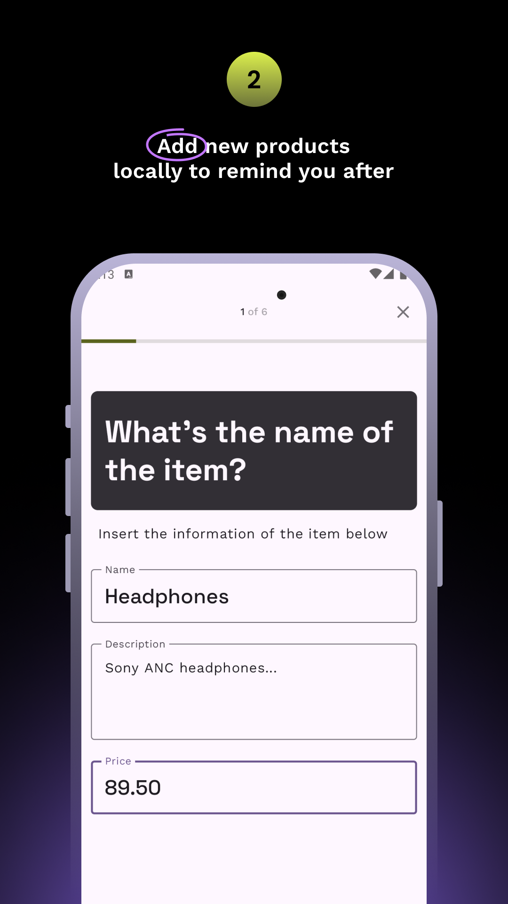
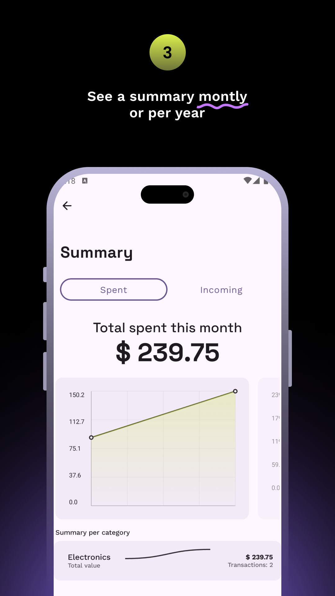
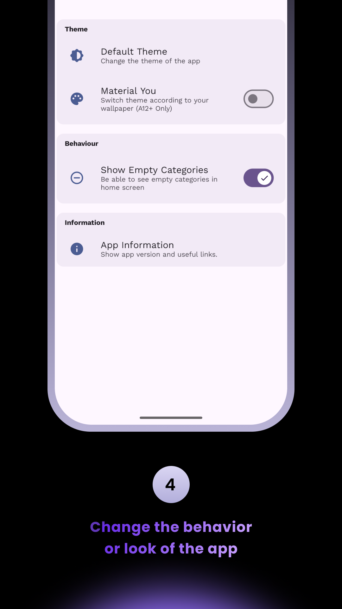
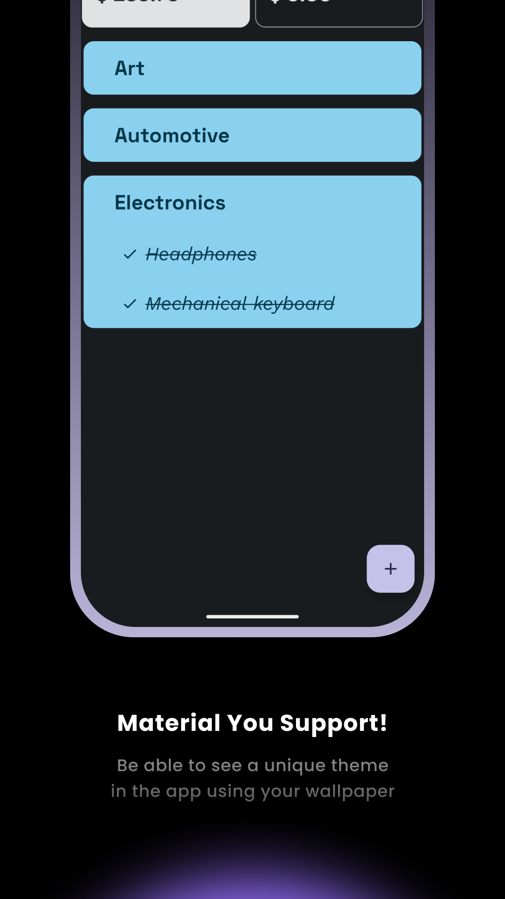

)

# BuyBuddy: Your Ultimate Shopping Companion 

|                                                                                                            |                                                                                                            |                                                                                                            |
|:----------------------------------------------------------------------------------------------------------:|:----------------------------------------------------------------------------------------------------------:|:----------------------------------------------------------------------------------------------------------:|
|  |  |  |
|  |  |  |

Discover BuyBuddy: Your Ultimate Shopping Companion

Take control of your shopping decisions with BuyBuddy, the smart and intuitive app designed to help you track, evaluate, and manage your potential purchases. Whether it's a must-have gadget or a big-ticket item, BuyBuddy allows you to easily input essential details like name, price, category, usage, and the pros and cons of each product.

Never miss a deal or forget about a potential purchase with our built-in reminder feature, which lets you set a time and date to revisit your decision. Want to rethink a purchase or confirm it? BuyBuddy makes it effortless to edit, confirm, or delete items from your list.

Keep your spending in check with our comprehensive monthly and yearly summaries, categorized to give you a clear overview of your buying habits. All this, wrapped in the sleek and modern Google Material You design system, ensuring a seamless and beautiful user experience.

**Download BuyBuddy today and make smarter, more informed buying decisions _every_ time.**

## Project Requirements

- Java 17+
- The **latest stable** Android Studio (for easy install use [JetBrains Toolbox](https://www.jetbrains.com/toolbox-app/))

### Found a Bug?

For submitting bug reports, feature requests, questions, or any other ideas to improve, please read [CONTRIBUTING.md](/CONTRIBUTING.md) for instructions and guidelines first.

## Tech Stack

### Core

- 100% [Kotlin](https://kotlinlang.org/)
- 100% [Jetpack Compose](https://developer.android.com/jetpack/compose)
- [Material3 design](https://m3.material.io/) (UI components)
- [Kotlin Coroutines](https://kotlinlang.org/docs/coroutines-overview.html) (structured concurrency)
- [Kotlin Flow](https://kotlinlang.org/docs/flow.html) (reactive data stream)
- [Hilt](https://dagger.dev/hilt/) (DI)

### Testing
- [JUnit4](https://github.com/junit-team/junit4) (test framework, compatible with Android)
- [MockK](https://mockk.io/) (unit test assertions)
- [Turbine](https://github.com/cashapp/turbine) (Small testing library for kotlinx.coroutines - Flows)

### Local Persistence
- [DataStore](https://developer.android.com/topic/libraries/architecture/datastore) (key-value storage)
- [Room DB](https://developer.android.com/training/data-storage/room) (SQLite ORM)

### Build & CI
- [Gradle KTS](https://docs.gradle.org/current/userguide/kotlin_dsl.html) (Kotlin DSL)
- [Gradle convention plugins](https://docs.gradle.org/current/samples/sample_convention_plugins.html) (build logic)
- [Gradle version catalogs](https://developer.android.com/build/migrate-to-catalogs) (dependencies versions)
- [GitHub Actions](https://github.com/Ivy-Apps/ivy-wallet/actions) (CI/CD)
- [Fastlane](https://fastlane.tools/) (uploads the app to the Google Play Store)

### Other
- [Firebase Crashlytics](https://firebase.google.com/products/crashlytics) (stability monitoring)
- [Ktlint](https://github.com/pinterest/ktlint) (linter)
